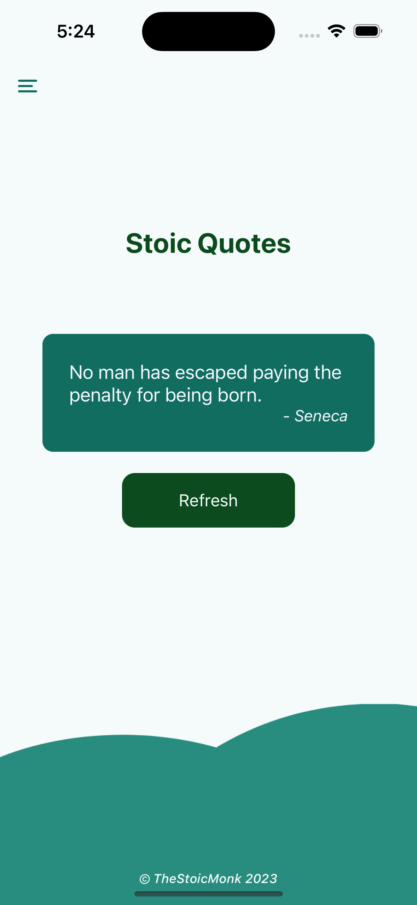

## TheStoicMonk

<!--  -->

This is the old version of the App and I have moved to create a revamped version of the app. This project has been deprecated. Click [here](https://github.com/jayantaadhikary/TheStoicMonkV2) to check the new project. 

This App displays Random Stoic Quotes from Seneca, Marcus Aurelius, and Epictetus. This app contains a Meditation Counter for 2 mins which plays ambient background music to bring out your inner peace. It also consists of a To-Do list where you can note down your pending tasks and check them off.

Built using React Native.

> Thanks to [benhoneywill](https://github.com/benhoneywill) for his API through https://stoic-quotes.com

The Screenshots for the app is attached below -

    
    

    
    

